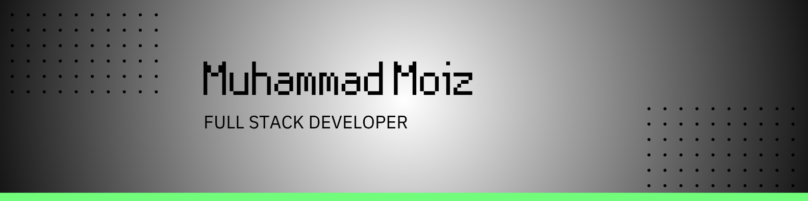
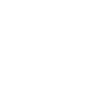
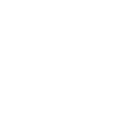

  

<h1 align="center">Hi 👋, I'm Muhammad Moiz</h1>

  
  
  

## 🚀 About Me

- 🔭 I'm currently working on The Odin Project
- 🌱 I'm currently learning Full Stack Development
- 💬 Ask me about anything tech
- 📫 How to reach me: mmoiz.dev@gmail.com
- ⚡ Fun fact: I skate

> "Code is like humor. When you have to explain it, it's bad." – Cory House

## 📊 Current Status

  

## 🛠️ Tech Stack

    
    
    
    
    
    
    
    
     
    
    
    
     
    
    
    
    
    
    
     
    
     
    
    
     
             
    
    
    
    
    
    
    
    
    
    
    
    
    
    
    
    
    
    
    
    

## 🚀 Projects

  <table>
    <tr>
      <td width="100%">
        <h3 align="center">Project</h3>
        

          
        

        

          
        

        

          <strong>Technologies:</strong> ReactJS,
          Firebase, NextJS, Typescript, TailwindCSS
        

      </td>
    </tr>
  </table>

## 📈 GitHub Stats

    
    

## 📧 Get In Touch

  
  

  Made with ❤️ by Muhammad Moiz

  Last updated: <time>June 2025</time>

